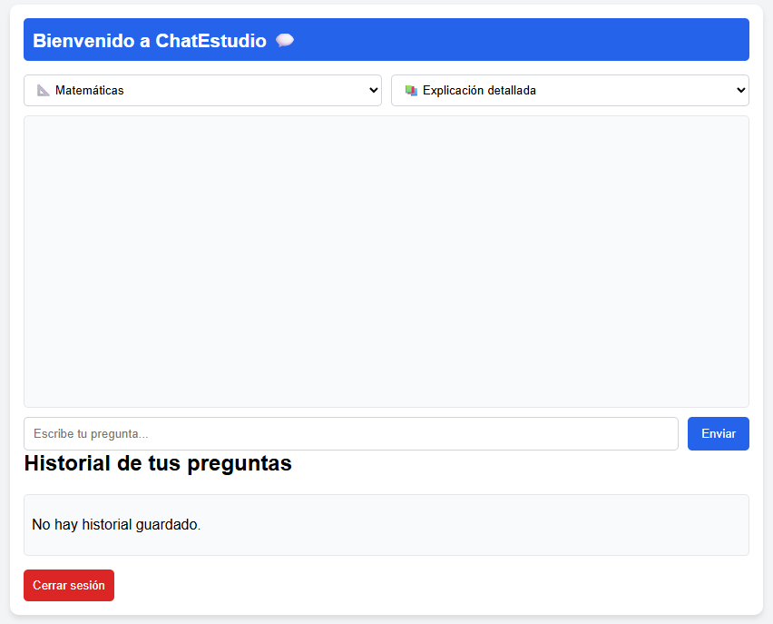
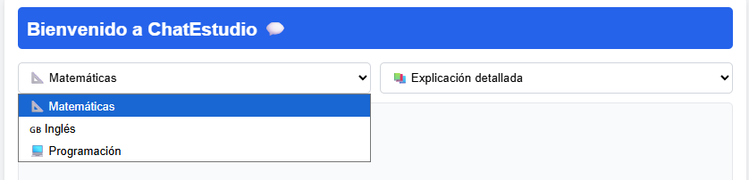
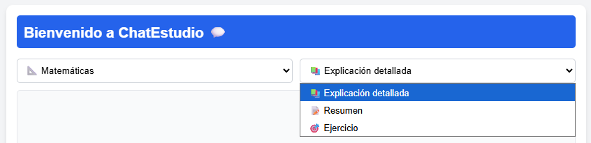
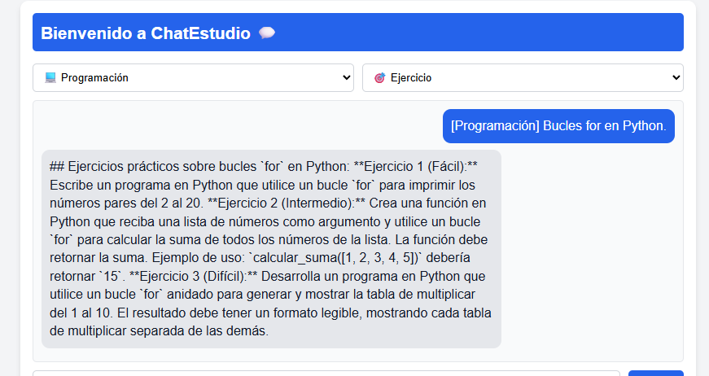
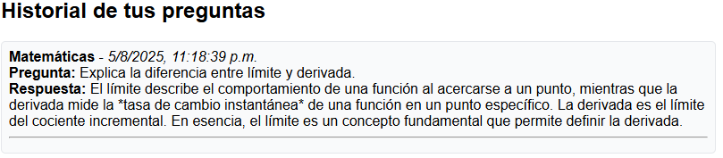

# 📚 ChatEstudio – Chatbot Inteligente de Soporte Estudiantil

## 1️⃣ Problema que resuelve
Ayudar a los estudiantes a repasar temas fuera del horario de clase, sin necesidad de un docente.  
ChatEstudio está disponible 24/7 para que el usuario pueda reforzar lo aprendido cuando quiera.

## 2️⃣ Usuario objetivo
Estudiantes de preparatoria o universidad que cursan materias complejas y buscan reforzar lo aprendido.

## 3️⃣ Materias incluidas en el MVP
- Matemáticas  
- Inglés  
- Programación  

## 4️⃣ Funcionalidades del MVP
| Funcionalidad          | Descripción                                                 |
| ---------------------- | ----------------------------------------------------------- |
| Chat tipo conversación | Input de texto y respuestas generadas por la IA             |
| Selector de materia    | Para orientar mejor la respuesta del modelo                 |
| Registro/Login         | Para guardar historial de estudio personalizado             |
| Historial de preguntas | Ver qué ha preguntado el usuario anteriormente              |
| Prompts dirigidos      | Adaptar la respuesta de la IA al contexto académico/materia |

## 5️⃣ Tecnologías utilizadas
- **Backend:** Node.js, Express, SQLite  
- **Frontend:** HTML5, CSS3, JavaScript (ES6+)  
- **Autenticación:** JWT (JSON Web Tokens)  
- **Inteligencia Artificial:** Integración con LLM (Google Gemini 1.5 Flash / OpenAI GPT)  
- **Herramientas:** Fetch API para comunicación cliente-servidor  

## 6️⃣ Cómo usarlo localmente

### Pre-requisitos
- Node.js instalado  
- Git instalado  

### Pasos
```bash
    git clone https://github.com/tu-usuario/chatestudio.git
    cd chatestudio
    npm install
    npm start
```
Abre tu navegador en http://localhost:3000 y registra un usuario para comenzar.







